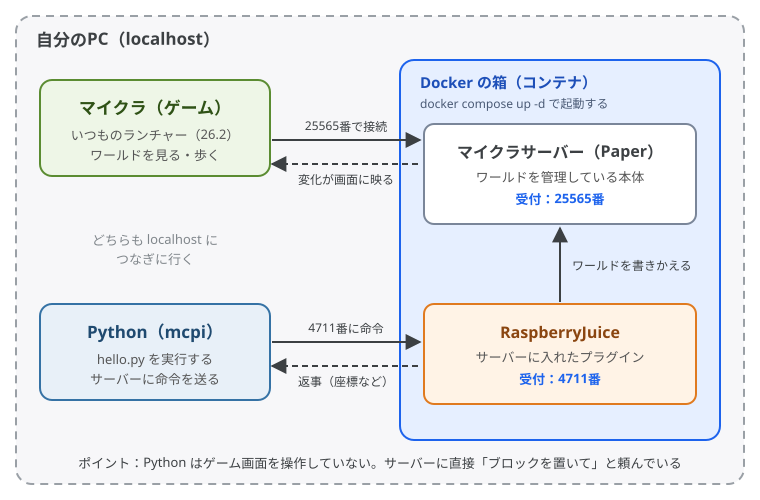

# mcpi-java

本リポジトリは、**Minecraft Java版を Python で操作する**ための配布環境です。  
自分のPCに **Docker** でマイクラサーバーを立てることで、`Python` での操作が可能になります。

> **背景:** **Minecraft_ライセンス版でのmcpi環境構築**が非常に煩雑だったため、環境を配布。  
> これにより、環境要因でのエラー時など、自PCを接続してトラブル対応などを行うことが可能に。 
>  
> ※ ポート開放はもちろん行ないませんので、ご安心ください。

## ファイル構成

```
mcpi-java/
├── README.md              # このページ
├── docker-compose.yaml    # マイクラサーバーの設定（バージョン・ポートなど）
├── plugins/
│   └── RaspberryJuice/
│       └── config.yml     # Python から操作するためのプラグインの設定
├── scripts/
│   └── sample.py          # 動作確認用のサンプル ← ✏️ ここに自分のプログラムを置く
├── pyproject.toml         # Python で使うライブラリの一覧（uv 用）
├── uv.lock                # ライブラリのバージョン固定（uv 用）
├── .python-version        # Python のバージョン（3.12）
└── docs/
    ├── setup.md           # 環境構築手順書
    ├── guide/             # 解説資料
    └── images/            # 図
```

> ✏️ ふだん触るのは `scripts/`（Python のプログラム）だけです。それ以外は環境の設定なので、基本的に変更しなくて大丈夫です。
>
> 各ファイルの詳しい説明は [環境構築手順書の「13. ファイル構成」](docs/setup.md#13-ファイル構成) へ。


## しくみ



自分のPCの中で、Docker の箱に入ったマイクラサーバーが動いています。そこに「いつものマイクラ」と「Python」の両方がつなぎに行きます。
詳しくはこちら 👉 [そもそもどういう仕組み？](docs/guide/how-it-works.md)

### コード例

```python
from mcpi.minecraft import Minecraft
mc = Minecraft.create()

# チャットにコメントを表示
mc.postToChat("swimmy is sai-ko~!!!")

# ブロックを配置
pos = mc.player.getTilePos()
mc.setBlock(pos.x, pos.y + 2, pos.z, 46, 1)
```

## クイックスタート

### 必要なもの

- Minecraft Java版（購入済みのアカウント）
- [Docker Desktop](https://www.docker.com/products/docker-desktop/)
- [uv](https://docs.astral.sh/uv/)（pip でもOK。その場合は Python 3.12 以上が必要）
- [VS Code](https://code.visualstudio.com/) ＋ [Python 拡張機能](https://marketplace.visualstudio.com/items?itemName=ms-python.python)（おすすめ）

### 手順

```bash
git clone <このリポジトリのURL>
cd mcpi-java
docker compose up -d   # サーバー起動（初回は数分かかる）
uv sync                # Python環境の準備（初回のみ）
```

> **💡 pip を使う場合**は、`uv sync` の代わりに `pip install mcpi` でOKです。

1. マイクラを **バージョン 26.2** で起動して、マルチプレイ → サーバーを追加 → `localhost` に接続
2. ワールドに入ったら、VS Code で `scripts/sample.py` を開いて、右上の **▷（実行ボタン）** を押す

チャットに「hogehoge」が出て、頭の上に金ブロックが置かれたら成功です！

詳細な手順は 👉 **[環境構築手順書（docs/setup.md）](docs/setup.md)** をご参照ください。

## 解説資料

「そもそも何をしているの？」を知りたい人向けの資料です。

| 資料 | 内容 |
|---|---|
| [そもそもどういう仕組み？](docs/guide/how-it-works.md) | サーバーを立ててから Python で操作できるようになるまでの全体像 |
| [Docker って何？](docs/guide/docker.md) | サーバーを「箱」に入れて動かす道具の話 |
| [localhost とポートって何？](docs/guide/localhost-and-ports.md) | `localhost:4711` の意味。いちばんハマりやすいところ |
| [Paper と RaspberryJuice って何？](docs/guide/paper-and-raspberryjuice.md) | マイクラサーバー本体と、Python から操作するためのプラグイン |
| [uv って何？ pip と何が違うの？](docs/guide/uv.md) | Python の環境をみんなで同じにする道具の話 |
